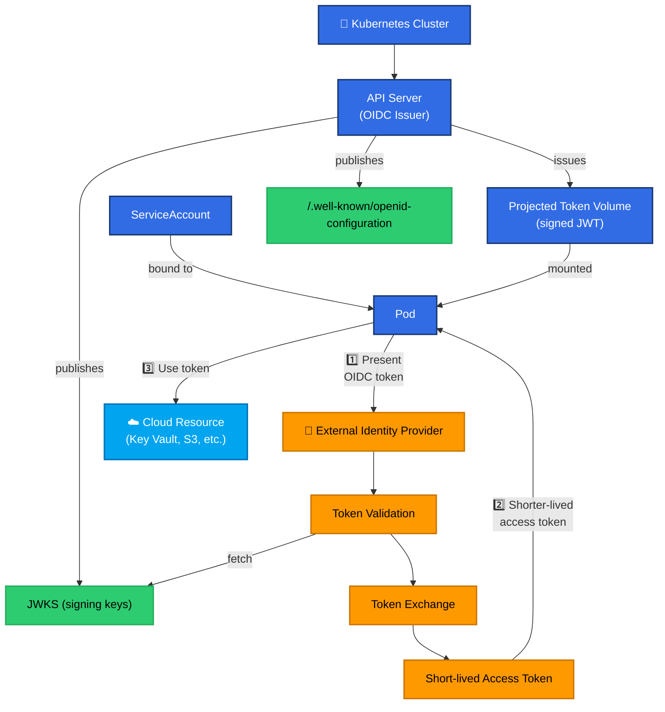
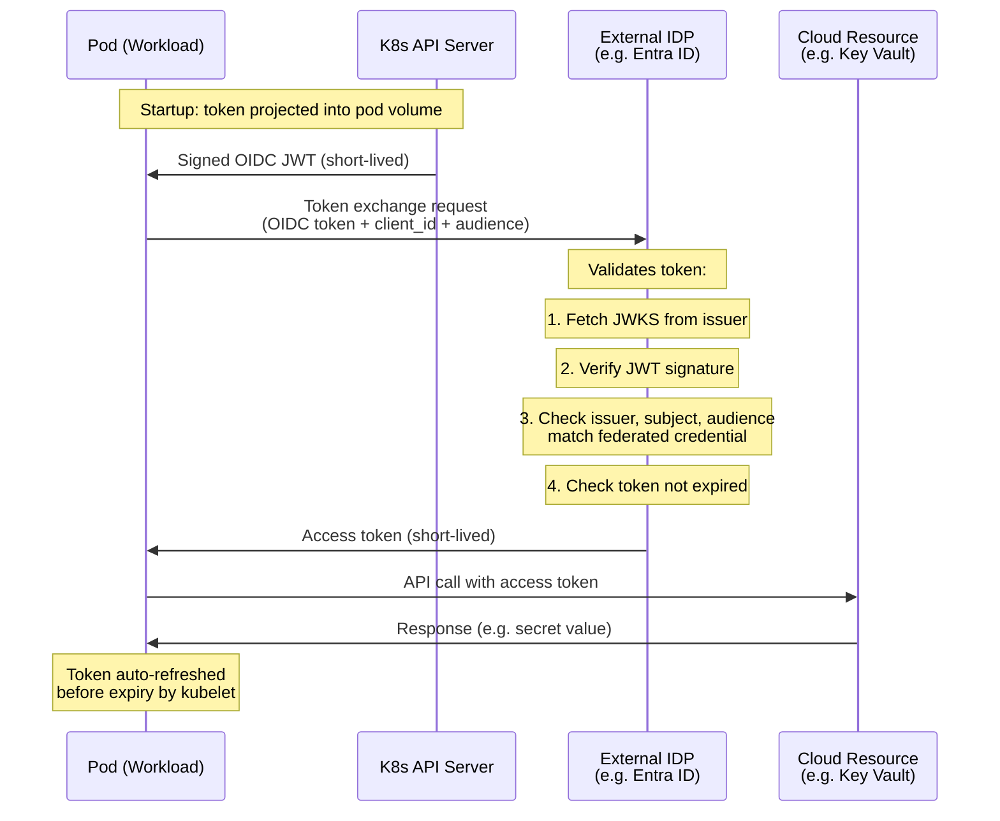
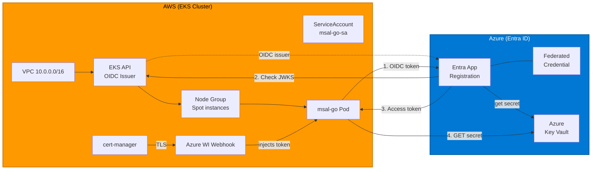
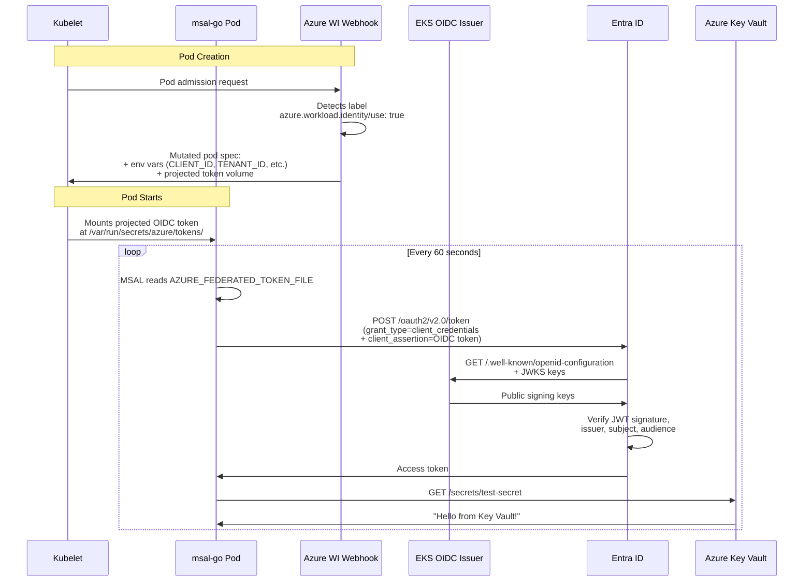

# Kubernetes OIDC Federation Examples

Example deployments demonstrating Kubernetes OIDC federation to external identity providers — enabling **zero-secret, cross-cloud workload authentication**.

---

## Why OIDC Federation Matters for Kubernetes

Modern Kubernetes workloads frequently need to access resources in external cloud providers (Azure, AWS, GCP) or third-party services. Historically this meant storing long-lived credentials (client secrets, access keys, certificates) as Kubernetes Secrets — creating a large attack surface, rotation burden, and secret sprawl.

**OIDC federation eliminates all of that.** Instead of secrets, workloads prove their identity using cryptographically signed tokens issued by the Kubernetes API server itself. External identity providers validate these tokens and exchange them for short-lived access tokens — no static credentials ever leave the cluster.

### The Core Problem

```text
Traditional approach (insecure):
  Pod → reads static credential from K8s Secret → authenticates to external cloud

OIDC federation approach (secure):
  Pod → presents signed OIDC token → IDP validates token → issues short-lived access token
```

Static credentials are:

- **Risky** — if leaked, an attacker has persistent access until revoked
- **Operationally expensive** — must be rotated, audited, and distributed securely
- **Hard to scope** — often over-provisioned to avoid breakage during rotation

OIDC federation tokens are:

- **Ephemeral** — short-lived (minutes), automatically refreshed
- **Cryptographically bound** — tied to a specific ServiceAccount in a specific namespace on a specific cluster
- **Zero-touch** — no rotation, no distribution, no secrets to manage

---

## Kubernetes Service Account Token Volume Projection (SIG Auth)

This capability is built on the **Service Account Token Volume Projection** feature, developed under [Kubernetes SIG Auth](https://github.com/kubernetes/community/tree/master/sig-auth) and graduating to stable in Kubernetes v1.20 ([KEP-2799](https://github.com/kubernetes/enhancements/tree/master/keps/sig-auth/2799-reduction-of-secret-based-service-account-token)).

### How It Works

Every Kubernetes cluster runs an OIDC-compliant identity provider as part of the API server. When a ServiceAccount token is projected into a pod, the API server issues a signed JWT containing:

| Claim | Value |
| ------- | ------- |
| `iss` | The cluster's OIDC issuer URL (e.g. `https://oidc.eks.us-east-1.amazonaws.com/id/...`) |
| `sub` | `system:serviceaccount:<namespace>:<service-account-name>` |
| `aud` | Configurable audience (e.g. `api://AzureADTokenExchange`, `sts.amazonaws.com`) |
| `exp` | Short expiration (typically 1 hour) |

The cluster publishes its OIDC discovery document (`/.well-known/openid-configuration`) and JWKS (public signing keys) at the issuer URL. Any external identity provider can validate tokens by fetching these public keys — **no shared secret required**.

### SIG Auth References

- [Service Account Signing Key Retrieval (KEP-3107)](https://github.com/kubernetes/enhancements/tree/master/keps/sig-auth/3107-service-account-signing-key-retrieval) — added API server endpoints for OIDC discovery and JWKS
- [Reduction of Secret-based Service Account Tokens (KEP-2799)](https://github.com/kubernetes/enhancements/tree/master/keps/sig-auth/2799-reduction-of-secret-based-service-account-token) — drives the move from static to projected tokens
- [Bound Service Account Token Volume (KEP-1205)](https://github.com/kubernetes/enhancements/tree/master/keps/sig-auth/1205-bound-service-account-tokens) — the underlying projection mechanism
- [Service Account Token Volume Projection docs](https://kubernetes.io/docs/tasks/configure-pod-container/configure-service-account/#serviceaccount-token-volume-projection) — official Kubernetes documentation

---

## General Architecture

The following diagram shows the universal pattern for Kubernetes OIDC federation, regardless of which external identity provider is involved:



### Trust Establishment

Before any token exchange can happen, a **federated identity credential** (or trust relationship) must be registered with the external identity provider. This one-time configuration says:

> *"I trust tokens from issuer X, for subject Y, with audience Z."*

| Field | Example |
| ------- | --------- |
| **Issuer** | `https://oidc.eks.us-east-1.amazonaws.com/id/ABCDEF123456` |
| **Subject** | `system:serviceaccount:my-namespace:my-service-account` |
| **Audience** | `api://AzureADTokenExchange` |

This is the **only configuration needed** — no secrets, no certificates, no key distribution.

---

## Token Exchange Flow



---

## Demo Catalogue

The table below lists the available use-case demonstrations. Each demo is a self-contained deployment in the `demos/` directory with its own README, Terraform configuration, and step-by-step instructions.

| # | Demo | Source → Target | Description | Status |
| --- | ------ | ----------------- | ------------- | -------- |
| 1 | [EKS → Azure Workload Identity](demos/eks-azure-workload-identity/) | AWS EKS → Azure (Entra ID) | Pod on EKS authenticates to Azure Key Vault using OIDC federation and the Azure Workload Identity webhook — zero secrets | ✅ Available |
| 2 | K3s → AWS (IRSA) | K3s (on-prem) → AWS | *Planned* | 🔜 Coming soon |
| 3 | AKS → AWS (IRSA) | Azure AKS → AWS | *Planned* | 🔜 Coming soon |
| 4 | OCP → Azure (Entra ID) | OpenShift (on-prem) → Azure (Entra ID) | *Planned* | 🔜 Coming soon |

---

## Demo 1: EKS → Azure Workload Identity

**Directory:** [`demos/eks-azure-workload-identity/`](demos/eks-azure-workload-identity/)

This demo provisions a minimal, cost-optimised AWS EKS cluster and installs the [Azure Workload Identity](https://azure.github.io/azure-workload-identity/) webhook. A sample `msal-go` application running on EKS authenticates to Azure Key Vault **without any static credentials** by exchanging its Kubernetes OIDC token for an Entra ID access token.

### Demo Architecture



### Demo Token Exchange Flow



### What Gets Deployed

| Layer | Resources |
| ------- | ----------- |
| **AWS Networking** | VPC, 3 public + 3 private subnets, Internet Gateway (no NAT GW for cost savings) |
| **AWS Compute** | EKS v1.34 control plane, Spot node group (`t3a.small`) in public subnets |
| **AWS IAM** | OIDC provider, IRSA role for the demo pod |
| **Kubernetes** | cert-manager, Azure Workload Identity webhook, `msal-go-demo` namespace + ServiceAccount |
| **Azure** | Federated identity credential on pre-existing Entra App Registration |
| **Demo App** | `msal-go` container that reads a Key Vault secret every 60s |

### Quick Start

See the full [EKS → Azure Workload Identity README](demos/eks-azure-workload-identity/README.md) for prerequisites, step-by-step instructions, and troubleshooting.

---

## Repository Structure

```text
kube-oidc-federation-examples/
├── README.md                              ← You are here
├── LICENSE
└── demos/
    └── eks-azure-workload-identity/       ← Demo 1
        ├── README.md                      ← Full walkthrough
        ├── main.tf                        ← Provider config + cluster readiness
        ├── vpc.tf                         ← VPC, subnets, IGW
        ├── eks.tf                         ← EKS cluster + node group
        ├── iam.tf                         ← IRSA role for demo pod
        ├── helm.tf                        ← cert-manager + WI webhook Helm charts
        ├── kubernetes.tf                  ← Namespace, ServiceAccount, msal-go Deployment
        ├── federation.tf                  ← Automatic federated credential setup
        ├── variables.tf                   ← Input variables
        ├── outputs.tf                     ← Useful outputs (kubeconfig, logs, etc.)
        ├── versions.tf                    ← Provider version constraints
        ├── backend.tf                     ← State backend config
        └── scripts/
            └── configure-federation.sh    ← az CLI script for federation
```

---

## Contributing

To add a new demo:

1. Create a directory under `demos/` with a descriptive name (e.g. `gke-aws-irsa`)
2. Include a self-contained Terraform (or equivalent) configuration
3. Write a comprehensive `README.md` with prerequisites, architecture, quick-start steps, and teardown instructions
4. Update the **Demo Catalogue** table in this root README

---

## License

See [LICENSE](LICENSE).
